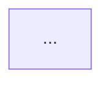
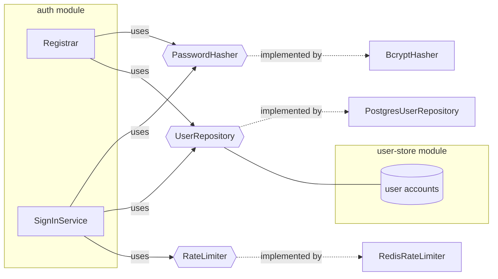
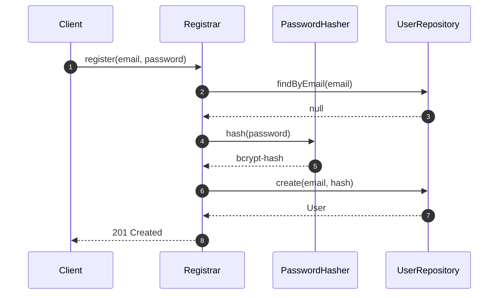

# Architecture corpus

This folder holds the **system-level** architecture of the project — the
stable frame every `sdd-new` feature builds upon. It is authored and
amended exclusively through the `sdd-architecture` workflow.

## Ownership and gating

- **Owned by:** the `sdd-architecture` workflow.
- **Amendments:** only through a PR labeled `architecture`, approved by
  the CODEOWNERS declared for `docs/architecture/` in the repository's
  `CODEOWNERS` file.
- **Read by:** every subsequent `sdd-new` invocation (as its stable
  frame) and the `architecture-protection` skill (which hard-gates any
  feature PR that touches this folder).
- **Never edited by:** `sdd-new`. Attempts to edit these files inside a
  feature PR are hard-gated by `architecture-protection`.

## File granularity

One file per architectural concern. Concerns are stable, coarse-grained
capability domains — not features. Typical examples:

- `persistence.md` — data model at rest, storage engine, migration
  strategy.
- `auth.md` — identity model, authentication flow, session semantics.
- `messaging.md` — synchronous and asynchronous message contracts, queue
  topology.
- `deployment.md` — runtime shape, environments, secret injection, blue
  / green expectations.
- `observability.md` — logging, metrics, tracing conventions system-wide.
- `security-posture.md` — threat model, trust boundaries, cross-feature
  security invariants.

The set above is illustrative. Introduce a new file only when a genuinely
new cross-cutting concern emerges. Do not create per-feature files here —
those belong in `docs/design/`.

## Modules map to source directories

Every module you name in a file's `MODULES` section maps **1:1** to a source
directory `src/<slug>/`, where the slug is the module name lowercased with runs
of non-alphanumeric characters collapsed to `_` (`IngestData` → `ingestdata`,
`ingest_data` → `ingest_data`). The module is self-contained: its code and its
**co-located** tests live together (`src/<slug>/` + `src/<slug>/tests/`).

Directory names carry **no pipeline-order prefix** — a module runs where the
sequence diagram says it runs, possibly more than once; the directory is its
single identity. This bijection is enforced by the `module-structure` skill and
`scripts/check-module-structure.sh`.

## Required sections per file

Every file MUST contain the sections mandated by the `design-artifacts`
skill (see `skills/design-artifacts/SKILL.md`):

- `SUMMARY` — one-paragraph description of the concern.
- `REQS_COVERED` — REQ UIDs covered, drawn exclusively from the
  `REQ-ARCH-*` namespace.
- `MODULES` — modules and their one-line responsibility statements.
- `PORTS` — interface types exposed or consumed.
- `ADAPTERS` — concrete implementations mapped to ports.
- `DATA_FLOW` — primary flow through the concern (prose).
- `DIAGRAMS` — mermaid fenced blocks. See the diagram policy below.
- `DECISIONS` — `@adr[NNNN]` references to foundational ADRs.
- `SECURITY_TEST_PLAN` — attached test templates per trust boundary.

## Diagram policy

Architecture files MUST include **exactly two** spec-level mermaid
diagrams in the `DIAGRAMS` section:

1. A `flowchart` component diagram showing every `MODULES`, `PORTS`, and
   `ADAPTERS` entry as a node, and their relationships as edges.
2. A `sequenceDiagram` (or `stateDiagram-v2` for lifecycle-oriented
   concerns) rendering the primary `DATA_FLOW`.

**Single authoring choke-point.** Both diagrams are authored exclusively
by the `mermaid-intake` skill (`skills/mermaid-intake/SKILL.md`) during
Phase 1 of `sdd-architecture`, through a two-gate interactive critique
loop terminated by explicit human approval tokens
(`APPROVE FLOWCHART <slug>` and `APPROVE SEQUENCE <slug>`). The approved
diagrams are persisted as standalone Mermaid files:

- `docs/architecture/diagrams/<slug>.flowchart.mmd`
- `docs/architecture/diagrams/<slug>.sequence.mmd`

Those two files are the **single source of truth**. Every downstream
artifact — including this architecture file itself — MUST reference
them, never re-draw them.

**Embed by reference.** The architecture file's `DIAGRAMS` section MUST
contain both diagrams **byte-identical** to the source files, each
preceded by an HTML comment naming the source file, e.g.

```markdown
<!-- source: docs/architecture/diagrams/auth.flowchart.mmd -->

```

`design-artifacts` performs this embedding and hard-gates on any
divergence (`DIAGRAM_DRIFT`). Editing a diagram in-place inside an
architecture file (bypassing `mermaid-intake`) is a hard-gate.

Diagrams are the **source of truth** — when prose and a diagram disagree,
reviewers trust the diagram. The `check-design-review.sh` script enforces
that every name declared in `MODULES` and `PORTS` also appears at least
once inside a mermaid block (medium enforcement).

Only mermaid fenced blocks are accepted; PlantUML, draw.io, ASCII art,
etc. hard-gate the design-review script.

## Canonical template

Below is a minimal architecture file that would pass all static checks.
Copy this shape when authoring a new file under `docs/architecture/`.

````markdown
# Auth architecture

## SUMMARY

Governs user identity, credential storage, and session issuance across
the system. Owned by the `auth` module. Every feature that consumes
identity MUST integrate through the ports declared here; no feature
introduces its own identity primitives.

## REQS_COVERED

- REQ-ARCH-005
- NFR-SEC-001

## MODULES

- **auth** — issues, validates, and revokes user sessions.
- **user-store** — persistent storage of user accounts.

## PORTS

- **PasswordHasher** (owned by `auth`) — hashes and verifies user secrets.
- **UserRepository** (owned by `user-store`) — CRUD over user records.
- **RateLimiter** (owned by `auth`) — per-identity request throttling.

## ADAPTERS

- **BcryptHasher** implements `PasswordHasher`, runtime `bcrypt`.
- **PostgresUserRepository** implements `UserRepository`, runtime `postgres`.
- **RedisRateLimiter** implements `RateLimiter`, runtime `redis`.

## DATA_FLOW

Given a client submits a registration request
When the email is not yet in `UserRepository`
Then `auth` hashes the password via `PasswordHasher` and creates a
user via `UserRepository`, returning the created identity.

## DIAGRAMS

<!-- source: docs/architecture/diagrams/auth.flowchart.mmd -->


<!-- source: docs/architecture/diagrams/auth.sequence.mmd -->


## DECISIONS

- @adr[0007] — bcrypt cost 12 (p95 ≈ 250ms on target hardware).
- @adr[0011] — Redis rate-limiter over in-memory (multi-instance).

## SECURITY_TEST_PLAN

- `PasswordHasher` boundary → `tests/templates/password-hasher.security.test.ts`
- `RateLimiter` boundary → `tests/templates/rate-limiter.security.test.ts`
````

## What does NOT belong here

- Feature-specific REQs (`REQ-FUNC-*`) — those go in `docs/requirements/`
  and are consumed by `sdd-new`.
- Feature-specific designs — those go in `docs/design/`.
- ADRs — those live under `docs/adr/`, referenced from here via the
  `@adr[NNNN]` marker.
- Source code, tests, alerts, dashboards, health-checks.

## Cross-references

- **Workflow:** `workflows/sdd-architecture.md`
- **Guard skill:** `skills/architecture-protection/SKILL.md`
- **Design skill:** `skills/design-artifacts/SKILL.md`
