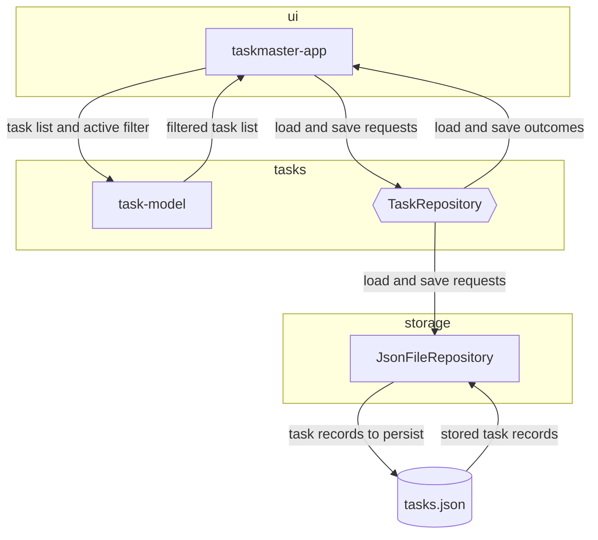
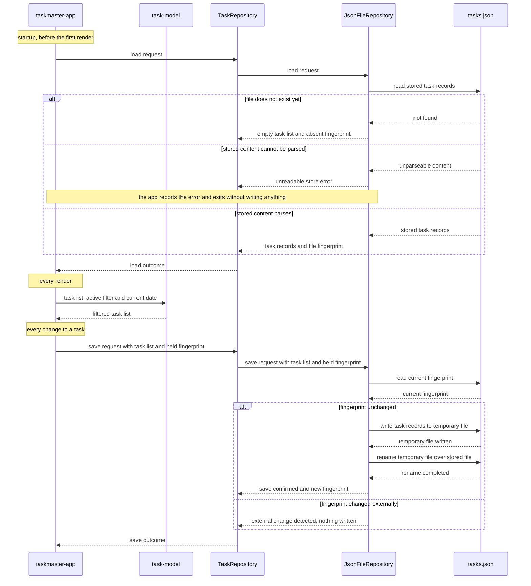

# Baseline architecture — Taskmaster

## SUMMARY

Taskmaster is a single-user terminal task manager with no network and no accounts. Three modules
divide it: `ui` runs the interface and owns all in-memory state, `tasks` holds the task record shape
and the pure filters plus the persistence contract, and `storage` implements that contract against a
local JSON file. The whole task list is loaded once at startup and filtered in memory, so the render
path performs no I/O and the domain stays free of both screen and disk. Every write is guarded twice
— by a fingerprint comparison that refuses to overwrite an externally changed store, and by a
temporary-file-then-rename sequence that survives an interrupted write. The two Mermaid diagrams
below are embedded by reference from `docs/architecture/diagrams/` and are the source of truth:
where this prose and a diagram disagree, the diagram is correct.

## REQS_COVERED

- REQ-ARCH-001
- REQ-ARCH-002
- REQ-ARCH-003
- REQ-ARCH-004
- REQ-ARCH-005
- REQ-ARCH-006
- REQ-ARCH-007
- REQ-ARCH-008
- REQ-ARCH-009
- REQ-ARCH-010
- REQ-ARCH-011
- REQ-ARCH-012
- REQ-ARCH-013
- REQ-ARCH-014
- REQ-ARCH-015
- REQ-ARCH-016
- REQ-ARCH-017
- REQ-ARCH-018
- REQ-ARCH-019
- REQ-ARCH-020
- REQ-ARCH-021
- REQ-NFR-PERF-001

## MODULES

- **ui** — COMPOSITION_ROOT. Runs the terminal interface, holds the complete task list and the active filter in memory, translates key presses into actions, and is the only module that instantiates a concrete adapter and binds it to the port at startup.
- **tasks** — Defines the task record shape and the pure filters selecting tasks by space, by due date and by overdue state, and declares the port through which task records are persisted.
- **storage** — Implements the persistence port against the store, and is the only module aware of the store's format and location.

## PORTS

- **TaskRepository** — owning module: tasks — intent: load every task record together with a file fingerprint, and save the full task list against the fingerprint the caller holds.

## ADAPTERS

- **JsonFileRepository** — implements: TaskRepository — runtime: json-file — the real adapter, reading and writing the store.
- **InMemoryRepository** — implements: TaskRepository — runtime: in-memory — the test double, holding records in memory so the port can be exercised without a filesystem.

`InMemoryRepository` is deliberately absent from the component flowchart: it is a test double, not a
part of the running system. It is declared above because the ports-and-adapters invariant is read
from this file, not from the diagram.

## DATA_FLOW

Startup:

1. `ui` → `tasks` (via `TaskRepository`) — a load request.
2. `tasks` → `storage` (via `TaskRepository`) — the bound adapter receives the request unchanged.
3. `storage` → `ui` (via `TaskRepository`) — every stored task record with a file fingerprint, or an
   empty task list when no store exists, or an unreadable-store error when its content cannot be
   parsed. On that error `ui` reports it and stops without writing.

Render:

4. `ui` → `tasks` — the complete task list, the active filter, and the current date.
5. `tasks` → `ui` — the filtered task list, selected by pure functions that read no clock and touch
   no store.

Change:

6. `ui` → `tasks` (via `TaskRepository`) — the full task list with the file fingerprint held since
   the load.
7. `tasks` → `storage` (via `TaskRepository`) — the bound adapter receives it unchanged, recomputes
   the store's current fingerprint, and compares.
8. `storage` → `ui` (via `TaskRepository`) — on a match, the records are written to a temporary file
   which is then renamed over the store, and a new fingerprint is returned; on a difference nothing
   is written and the external change is reported.

## DIAGRAMS

Component flowchart — the constitutive blocks and their information flows.

<!-- source: docs/architecture/diagrams/baseline.flowchart.mmd -->

Sequence diagram — the temporal interactions between those blocks.

<!-- source: docs/architecture/diagrams/baseline.sequence.mmd -->

## DECISIONS

- @adr[0001] — state lives in the ui block; the store is a backup read once and written on change.
- @adr[0002] — a JSON file store, not an embedded database.
- @adr[0003] — detect external change, never merge automatically.
- @adr[0004] — the reference date is injected into the filters.
- @adr[0005] — the file fingerprint is a content hash.
- @adr[0006] — logs are written to a file, never to the terminal.

## SECURITY_TEST_PLAN

`TaskRepository` is the only port, and it is classified `persistence`: it reads from and writes to a
durable store holding the user's data at rest. It is not `public-inbound` — nothing reaches it from
a network — nor `third-party-outbound`, nor `auth-provider`.

- **TaskRepository** — classification: persistence — templates: persistence-tests, input-validation-tests.

`persistence-tests` is required by the classification and covers data at rest: the store is created
with permissions that do not expose it to other users of the machine, and the temporary file used by
the rename sequence is created with the same restriction rather than a default mode.

`input-validation-tests` is planned beyond what the classification requires. ADR 0002 keeps the
store hand-editable on purpose, which means its content is written by parties other than this
application and must be treated as untrusted input: `REQ-ARCH-018` requires that unparseable content
is rejected without crashing and without overwriting, and that path needs malformed, truncated,
oversized and wrong-typed payloads exercised against it.

No `NFR-SEC` requirement is in `REQS_COVERED`, so no additional template is mandated on that basis.
