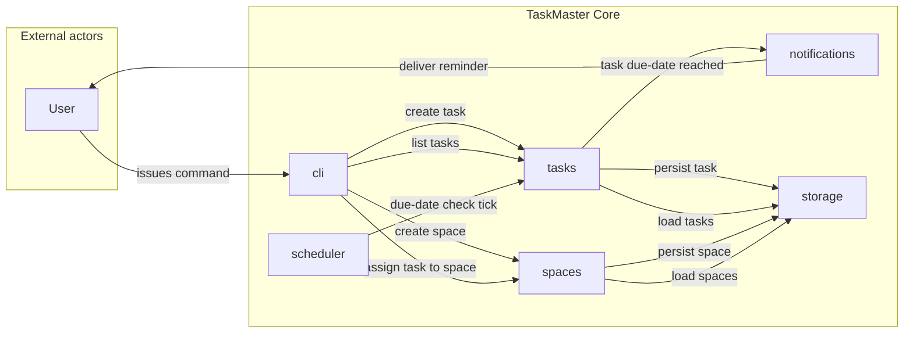
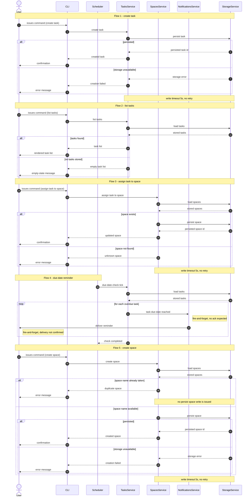
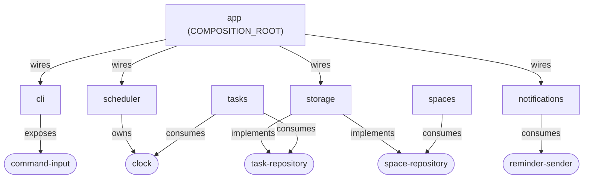

# Architecture — system-overview

## SUMMARY

TaskMaster Core is a single-user command-line task manager. A `cli` module turns
a Command from the User into exactly one task or space operation; `tasks` and
`spaces` hold the domain logic; `storage` persists both through repository
ports; a `scheduler` ticks Due Date evaluation so `notifications` can deliver a
Reminder to the User independently of any Command. `app` is the composition
root and the only site that instantiates concrete adapters.

This document covers the whole system-level architecture and is the stable
frame every subsequent `/sdd-new` feature builds on.

## REQS_COVERED

- REQ-ARCH-001
- REQ-ARCH-002
- REQ-ARCH-003
- REQ-ARCH-004
- REQ-ARCH-005
- REQ-ARCH-006
- REQ-ARCH-007
- REQ-ARCH-008
- REQ-ARCH-009
- REQ-ARCH-010
- REQ-ARCH-011
- REQ-ARCH-012
- REQ-ARCH-013
- REQ-ARCH-014
- REQ-ARCH-015
- REQ-ARCH-016
- REQ-ARCH-017
- REQ-ARCH-018
- REQ-ARCH-019
- REQ-ARCH-020
- REQ-ARCH-021
- REQ-ARCH-022
- REQ-ARCH-023
- REQ-ARCH-024
- REQ-ARCH-025
- REQ-ARCH-026
- REQ-ARCH-027
- REQ-ARCH-028
- REQ-ARCH-029
- REQ-ARCH-030
- REQ-ARCH-031
- REQ-ARCH-032
- REQ-ARCH-033
- REQ-ARCH-034
- REQ-NFR-PERF-001
- REQ-NFR-PERF-002
- REQ-NFR-SEC-001

## MODULES

- **app** *(COMPOSITION_ROOT)* — wires every concrete adapter to its port and starts the process; the only module permitted to construct adapters.
- **cli** — translates a Command from the User into exactly one task or space operation and renders the result.
- **scheduler** — emits a due-date check tick on an interval so Due Date evaluation runs independently of any Command.
- **tasks** — owns Task lifecycle and decides whether a Task is an Overdue Task.
- **spaces** — owns Space creation, Space membership, and the assignment of a Task to a Space.
- **notifications** — turns a reported Overdue Task into exactly one Reminder addressed to the User.
- **storage** — satisfies the repository ports with durable persistence of Tasks and Spaces.

## PORTS

- **command-input** — owner: cli — intent: inbound intake of a Command issued by the User at the trust boundary.
- **task-repository** — owner: tasks — intent: durable load and persist of Tasks.
- **space-repository** — owner: spaces — intent: durable load and persist of Spaces.
- **reminder-sender** — owner: notifications — intent: outbound dispatch of a Reminder across the trust boundary.
- **clock** — owner: scheduler — intent: current-instant source used to evaluate a Due Date.

## ADAPTERS

- `ArgparseCommandInput` — implements: command-input — runtime: `stdlib-argparse` (real)
- `ScriptedCommandInput` — implements: command-input — runtime: `stub` (test double)
- `JsonFileTaskRepository` — implements: task-repository — runtime: `json-file` (real)
- `InMemoryTaskRepository` — implements: task-repository — runtime: `in-memory` (test double)
- `JsonFileSpaceRepository` — implements: space-repository — runtime: `json-file` (real)
- `InMemorySpaceRepository` — implements: space-repository — runtime: `in-memory` (test double)
- `StdoutReminderSender` — implements: reminder-sender — runtime: `stdout` (real)
- `RecordingReminderSender` — implements: reminder-sender — runtime: `fake` (test double)
- `SystemClock` — implements: clock — runtime: `stdlib-datetime` (real)
- `FrozenClock` — implements: clock — runtime: `fake` (test double)

## DATA_FLOW

- Create a Task: cli → tasks (via command-input) → storage (via task-repository); the persisted identifier returns, or a storage error surfaces to the User as an explicit failure.
- List Tasks: cli → tasks (via command-input) → storage (via task-repository); an empty store returns an empty Task List, never an error.
- Create a Space: cli → spaces (via command-input) → storage (via space-repository) to verify the name is free, then storage (via space-repository) for the write; a name already taken stops before any write and surfaces as an explicit error.
- Assign a Task to a Space: cli → spaces (via command-input) → storage (via space-repository) for existence verification, then storage (via space-repository) for the write; a missing Space stops before any write.
- Due-date sweep: scheduler → tasks (via clock) → storage (via task-repository) → notifications, then notifications → User (via reminder-sender); both hops are fire-and-forget and the tick is acknowledged regardless of delivery outcome.

## DIAGRAMS

Spec-level component structure, embedded by reference from the source of truth
frozen by `mermaid-intake`:

<!-- source: docs/architecture/diagrams/system-overview.flowchart.mmd -->

Spec-level temporal behavior, embedded by reference:

<!-- source: docs/architecture/diagrams/system-overview.sequence.mmd -->

Design-level ports-and-adapters view. This block is authored here and is NOT a
`mermaid-intake` source diagram; it adds no spec-level architectural claim and
only renders the port wiring declared above.

## DECISIONS

- @adr[0001] — JSON-file persistence via the standard library, no database engine.
- @adr[0002] — in-process `scheduler` driving Due Date evaluation through a `clock` port.
- @adr[0003] — fire-and-forget Reminder delivery; never reported as confirmed.
- @adr[0004] — `app` as the single composition root for adapter construction.

## SECURITY_TEST_PLAN

| Port | Trust classification | Templates |
|---|---|---|
| command-input | `public-inbound` | `authn-tests`, `authz-tests`, `input-validation-tests` |
| task-repository | `persistence` | `persistence-tests` |
| space-repository | `persistence` | `persistence-tests` |
| reminder-sender | `third-party-outbound` | `io-tests` |
| clock | `internal` | exempt |

NFR-SEC coverage:

- REQ-NFR-SEC-001 — covered by `persistence-tests` on task-repository and
  space-repository, and by `input-validation-tests` on command-input; its
  threshold of zero high-severity findings is measured by the `security-scan`
  suite across every module inside the `system` boundary.
