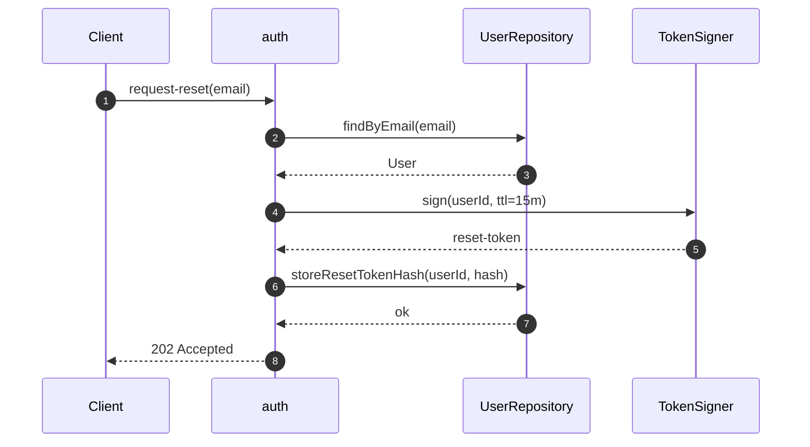

# Design corpus

This folder holds the **feature-level** designs of the project — one file
per feature scope, authored exclusively through the `sdd-new` workflow.
Feature designs are the bridge between requirements (`docs/requirements/`)
and implementation (`src/`, `tests/`).

## Ownership and gating

- **Owned by:** the `sdd-new` workflow.
- **Amendments:** through the same feature PR that authors or updates the
  counterpart requirement file. No design PR is opened independently.
- **Read by:** `testability-discipline`, `security-test-templates`,
  `design-review-gate` (all Phase 2), and `tdd-cycle-enforcement`
  (Phase 3).
- **Never edited by:** `sdd-architecture`. Architectural concerns belong
  in `docs/architecture/`; feature designs only **reuse** the modules,
  ports, and adapters declared there.

## File granularity

One file per feature scope, matching the `storage.one_file_per` value
resolved from `tech-stack-integrations/requirements-tracker.yaml` and
its counterpart requirement file. Do NOT create per-module or
per-adapter files here — modules and adapters belong in
`docs/architecture/`.

## Required sections per file

Every file MUST contain the sections mandated by the `design-artifacts`
skill (see `skills/design-artifacts/SKILL.md`):

- `SUMMARY` — one-paragraph description of the feature.
- `REQS_COVERED` — REQ UIDs covered, drawn from the `REQ-FUNC-*` and
  `NFR-*` namespaces. Every REQ in the counterpart requirement file
  MUST appear here.
- `MODULES` — modules touched by the feature and their one-line role.
  Names MUST already be declared under `docs/architecture/`.
- `PORTS` — interface types consumed or extended. Names MUST already be
  declared under `docs/architecture/`.
- `ADAPTERS` — concrete implementations used or added. Adapters MAY be
  introduced here provided they implement an existing architectural port.
- `DATA_FLOW` — the feature's happy path expressed as a
  `Given / When / Then` triple aligned with the acceptance criteria of
  the counterpart REQ.
- `DIAGRAMS` — mermaid fenced blocks. See the diagram policy below.
- `DECISIONS` — `@adr[NNNN]` references to any ADR authored during the
  feature.
- `SECURITY_TEST_PLAN` — attached test templates per trust boundary
  crossed by the feature.

## Diagram policy

Feature files MUST include **at minimum one** `sequenceDiagram` in the
`DIAGRAMS` section, rendering the feature's happy path.

**Single authoring choke-point.** The sequence diagram is authored
**upstream in Phase 1**, at:

- `docs/design/diagrams/<slug>.sequence.mmd`

This is the same file the `/sdd-new` starter references via its
`Diagram:` field (see `USER_MANUAL.md § 7.2`). Its Tier-1 shape is
enforced by the `requirements-authoring` skill's diagram-first
precondition. The design file MUST embed it **by reference**, byte-
identical, preceded by an HTML comment naming the source file — same
convention as architecture files:

```markdown
<!-- source: docs/design/diagrams/<slug>.sequence.mmd -->
```mermaid
sequenceDiagram
    ...
```
```

`design-artifacts` performs this embedding and hard-gates on any
divergence (`DIAGRAM_DRIFT`). Editing a diagram in-place inside a design
file (bypassing the upstream `.mmd` file) is a hard-gate.

**Reuse, do not introduce.** Every participant in the sequence diagram
MUST correspond to a module, port, or adapter already declared in some
file under `docs/architecture/`. A feature diagram naming a new module
or port is a hard-gate — the remedy is to run `/sdd-architecture` first
to amend the architecture layer.

Diagrams are the **source of truth** — when prose and a diagram
disagree, reviewers trust the diagram. `scripts/check-design-review.sh`
enforces that every name declared in `MODULES` and `PORTS` also appears
at least once inside a mermaid block (medium enforcement).

Only mermaid fenced blocks are accepted; PlantUML, draw.io, ASCII art,
etc. hard-gate the design-review script.

## Canonical template

Below is a minimal feature design that would pass all static checks.
Copy this shape when authoring a new file under `docs/design/`. It
assumes the auth architecture in `docs/architecture/README.md § Canonical
template` is already in place — the feature only reuses its modules and
ports.

````markdown
# Password reset — feature design

## SUMMARY

Lets an authenticated user request a password-reset link and set a new
password via a signed one-time token. Reuses the `auth` and `user-store`
modules declared in `docs/architecture/auth.md`; adds no new
architectural surface.

## REQS_COVERED

- REQ-FUNC-042
- NFR-SEC-003

## MODULES

- **auth** — issues and validates the reset token, updates the stored hash.
- **user-store** — looks up the account and persists the new hash.

## PORTS

- **PasswordHasher** — reused, no changes.
- **UserRepository** — reused, no changes.
- **TokenSigner** — reused, no changes.

## ADAPTERS

- **BcryptHasher** — reused.
- **PostgresUserRepository** — reused.
- **HmacTokenSigner** — reused.

## DATA_FLOW

Given a registered user submits their email
When the email resolves to an active account
Then `auth` issues a signed reset token, stores its hash, and returns a
`202 Accepted` while a side-channel delivery mechanism sends the token
to the account owner.

## DIAGRAMS

<!-- source: docs/design/diagrams/password-reset.sequence.mmd -->


## DECISIONS

- @adr[0023] — 15-minute token TTL (balances usability vs replay window).

## SECURITY_TEST_PLAN

- `TokenSigner` boundary → `tests/templates/token-signer.security.test.ts`
- Rate-limit on reset requests → `tests/templates/rate-limiter.security.test.ts`
````

## What does NOT belong here

- Architectural REQs (`REQ-ARCH-*`) — those go in `docs/requirements/`
  and are covered by architecture files under `docs/architecture/`.
- New modules or ports — those require an amendment via
  `/sdd-architecture`.
- ADRs — those live under `docs/adr/`, referenced from here via the
  `@adr[NNNN]` marker.
- Source code, tests, alerts, dashboards, health-checks.

## Cross-references

- **Workflow:** `workflows/sdd-new.md`
- **Spec skill:** `skills/requirements-authoring/SKILL.md` (diagram-first
  precondition authors `docs/design/diagrams/<slug>.sequence.mmd`).
- **Design skill:** `skills/design-artifacts/SKILL.md`
- **Companion corpus:** `docs/architecture/` (source of every module,
  port, and adapter reused here).
