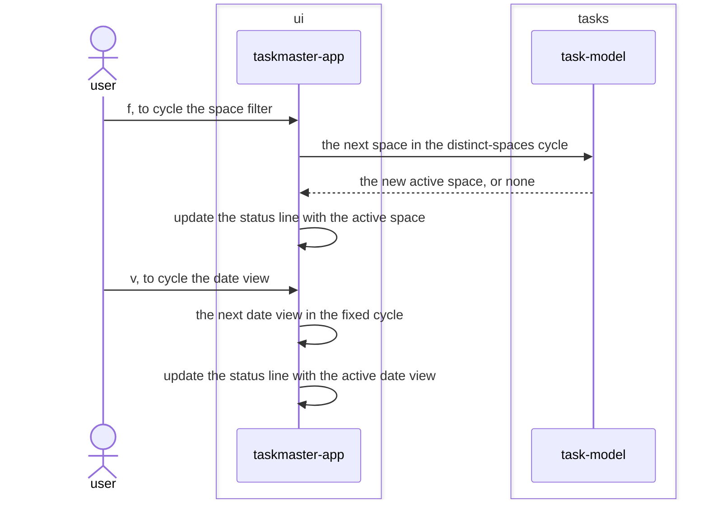

# Active-view-indicator feature design

## SUMMARY

Adds a one-line status widget below the add form showing the active space ("all" when none) and the
active date view ("all" when none), refreshed on every `cycle_filter`/`cycle_date_view` action —
piggy-backing on the same `_refresh_list` call site those actions already trigger, since both change
what `visible_tasks` shows. Pure display: reads `TaskmasterState.active_space`/`active_date_view`,
writes nothing back.

## REQS_COVERED

- REQ-FUNC-008

## MODULES

- **ui** — adds a status `Static` widget updated alongside every list refresh.

## PORTS

> None. Reading two already-in-memory attributes off `TaskmasterState` is not persistence.

## ADAPTERS

> None. No adapter changes.

## DATA_FLOW

1. `ui` (self) — the cycle-filter key advances `TaskmasterState.active_space` (via `task-model`'s `distinct_spaces`, already REQ-ARCH-006/007's existing flow) and refreshes the list.
2. `ui` (self) — the cycle-date-view key advances `TaskmasterState.active_date_view` and refreshes the list.
3. `ui` (self) — on every refresh, the status line is rewritten from the state's current `active_space`/`active_date_view`, showing "all" for either component when it is `None`.

## DIAGRAMS

<!-- source: docs/design/diagrams/active-view-indicator.sequence.mmd -->

## DECISIONS

None. No new dependency — a `textual.widgets.Static` covers a one-line read-only status display; no
new port, since `active_space`/`active_date_view` are already public attributes on the in-memory
`TaskmasterState` the composition root already holds a reference to.

## SECURITY_TEST_PLAN

> No port is touched by this feature. The status line renders `active_space`, which is user-entered
> text (a space name) — same untrusted-input posture as the task list's own text, so it is rendered
> with `markup=False` for the same reason REQ-ARCH-018 already requires it there.
