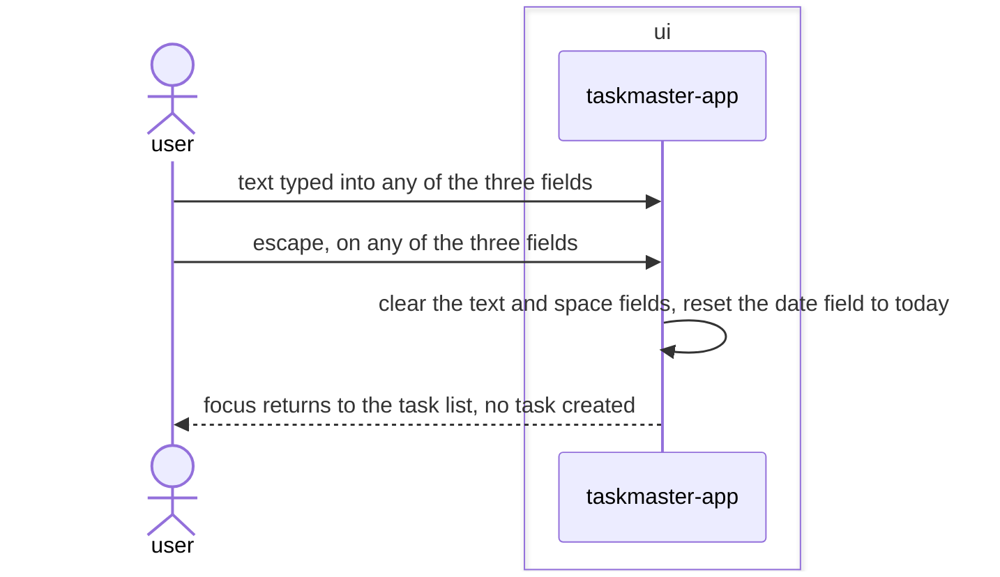

# Add-form-keyboard-controls feature design

## SUMMARY

Adds a single App-level `escape` binding that cancels the add form from any of its three fields:
clears text and space, resets the date field to today, and returns focus to the task list — the
same cleanup `on_input_submitted` already does after a successful add, minus building or saving a
task. Verified via a throwaway script before writing this: `Input` does not consume `escape`, so it
bubbles up to an App-level `BINDINGS` entry exactly like the other single-key bindings already do
while `ListView` holds focus. Tab/Shift+Tab are unchanged.

## REQS_COVERED

- REQ-FUNC-010

## MODULES

- **ui** — adds one action, `action_cancel_add_form`, alongside the existing add-form handling in `taskmaster-app`.

## PORTS

> None. Canceling the form touches no persisted state — `TaskRepository` is never called.

## ADAPTERS

> None. No adapter changes.

## DATA_FLOW

1. `ui` (self) — escape, while any add-form field has focus, clears the text and space fields and resets the date field to today.
2. `ui` (self) — focus returns to the task list; no task is built or saved.

## DIAGRAMS

<!-- source: docs/design/diagrams/add-form-keyboard-controls.sequence.mmd -->

## DECISIONS

None. No new dependency, no port change — a second App-level `BINDINGS` entry alongside the five
already there, reusing the exact field-reset logic `on_input_submitted` already has.

## SECURITY_TEST_PLAN

> No port is touched by this feature. Canceling discards in-memory field values without persisting
> anything; there is no new untrusted-input surface.
