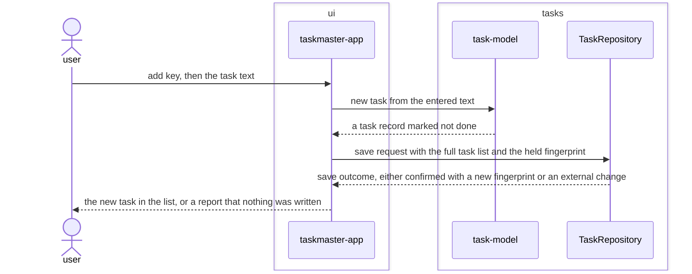

# Add-task feature design

## SUMMARY

The thinnest vertical slice through the merged baseline architecture: entering task text produces
a task record, appends it to the in-memory list `taskmaster-app` already holds, and persists the
full list through `TaskRepository`. No new module, port, or adapter is introduced — this feature
exercises the architecture's existing surface end to end for the first time. The feature sequence
diagram below is embedded by reference and is the source of truth for its acceptance criteria. It
stops at the `TaskRepository` port: everything below it — adapter dispatch, the fingerprint check,
the atomic write — is already specified by REQ-ARCH-010 through REQ-ARCH-021 and is not redrawn
here, so `storage` is not listed as a module of this design.

## REQS_COVERED

- REQ-FUNC-001

## MODULES

- **ui** — receives the add-key press and the entered text, and shows the resulting list or the external-change report.
- **tasks** — builds the new task record from the entered text, and holds the TaskRepository port through which the updated list reaches storage.

## PORTS

- **TaskRepository** — owning module: tasks — reused unchanged: the save operation this feature exercises is the one REQ-ARCH-003 already declares.

## ADAPTERS

- **JsonFileRepository** — implements: TaskRepository — runtime: json-file — reused unchanged.
- **InMemoryRepository** — implements: TaskRepository — runtime: in-memory — reused unchanged, exercised by this feature's tests.

## DATA_FLOW

1. `ui` → `tasks` — the entered task text.
2. `tasks` → `ui` — a new task record marked not done.
3. `ui` → `tasks` (via `TaskRepository`) — the full task list, including the new record, with the fingerprint held since the last load.
4. `tasks` → `ui` (via `TaskRepository`) — the save outcome: confirmed with a new fingerprint, or an external-change report.

## DIAGRAMS

<!-- source: docs/design/diagrams/add-task.sequence.mmd -->

## DECISIONS

None. This feature introduces no new architectural surface and makes no decision beyond what
ADR 0001 through ADR 0006 already settled — see `docs/architecture/baseline.md § DECISIONS`.

## SECURITY_TEST_PLAN

`TaskRepository` is exercised here exactly as classified in `docs/architecture/baseline.md`:
`persistence`, covered by `persistence-tests` and `input-validation-tests`. No new port is
introduced, so no new classification is needed.

- **TaskRepository** — classification: persistence (unchanged from the architecture) — templates: persistence-tests, input-validation-tests.

Both templates are inherited unchanged from `docs/architecture/baseline.md`; this feature adds no
new trust boundary and states no new validation rule. Any input-shape decision beyond what
REQ-FUNC-001 already states (task text, entered by the user) is out of scope for this feature and
is not assumed here.
