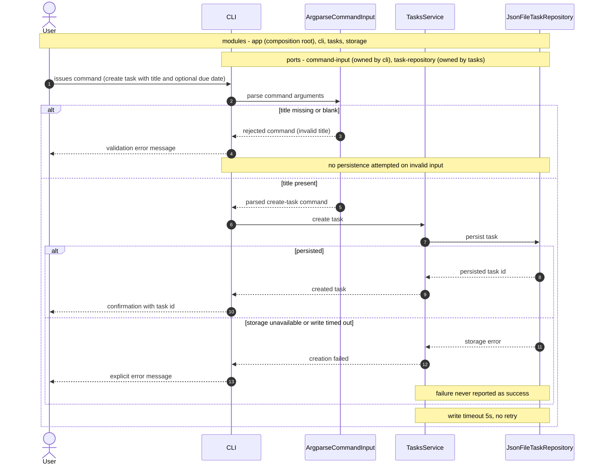

# Create task — feature design

## SUMMARY

Lets the User create a Task from the command line: the Command is parsed and validated at the trust boundary, a valid Task is persisted through the durable store, and the User receives either the persisted Task identifier or an explicit failure. Reuses the `app`, `cli`, `tasks`, and `storage` modules declared in `docs/architecture/system-overview.md`; adds no new architectural surface.

## REQS_COVERED

- REQ-FUNC-001
- REQ-FUNC-002
- REQ-FUNC-003

## MODULES

- **app** *(COMPOSITION_ROOT)* — wires each concrete adapter to its port and starts the process; the only module permitted to construct adapters.
- **cli** — translates a Command from the User into exactly one create-task operation and renders the result.
- **tasks** — owns Task creation and decides whether a submitted Command yields a valid Task.
- **storage** — satisfies the task-repository port with durable persistence of Tasks.

## PORTS

- **command-input** — owner: cli — intent: inbound intake of a Command issued by the User at the trust boundary.
- **task-repository** — owner: tasks — intent: durable load and persist of Tasks.

## ADAPTERS

- **ArgparseCommandInput** — implements: command-input — runtime: `stdlib-argparse` (real)
- **ScriptedCommandInput** — implements: command-input — runtime: `stub` (test double)
- **JsonFileTaskRepository** — implements: task-repository — runtime: `json-file` (real)
- **InMemoryTaskRepository** — implements: task-repository — runtime: `in-memory` (test double)

## DATA_FLOW

Primary flow: cli → tasks (via command-input) → storage (via task-repository).

Given the User issues a `create task` Command carrying a title
When `cli` accepts it through command-input and `tasks` persists it through task-repository
Then the persisted Task identifier returns to the User as a confirmation.

Branches:

- Given the title is missing or blank, When `cli` validates the Command at command-input, Then the User receives a validation error and task-repository is never reached.
- Given task-repository reports a storage error or exceeds the 5-second timeout, When `tasks` receives it, Then the User receives an explicit error and never a confirmation.

## DIAGRAMS

<!-- source: docs/design/diagrams/create-task.sequence.mmd -->

## DECISIONS

- @adr[0001] — Tasks are persisted to a JSON file; task-repository is satisfied by a file-backed adapter rather than a database.
- @adr[0004] — Hexagonal composition root: `app` is the only module that constructs concrete adapters, which is what makes both ports substitutable in tests.

## SECURITY_TEST_PLAN

| Port | Trust category | Templates |
|------|----------------|-----------|
| command-input | `public-inbound` — accepts a Command from the User, who is outside the trust boundary per REQ-ARCH-001 | `authn-tests`, `authz-tests`, `input-validation-tests` |
| task-repository | `persistence` — writes every Task to the durable store | `persistence-tests` |

`input-validation-tests` carries the weight here: REQ-FUNC-002 is the validation contract, and the title is the only untrusted free-text value the feature accepts. `authn-tests` and `authz-tests` are planned against a single-user local CLI with no identity provider and no privilege separation, so they assert the absence of an authorization surface rather than its behaviour — recorded explicitly so a later multi-user change cannot silently inherit the exemption.
