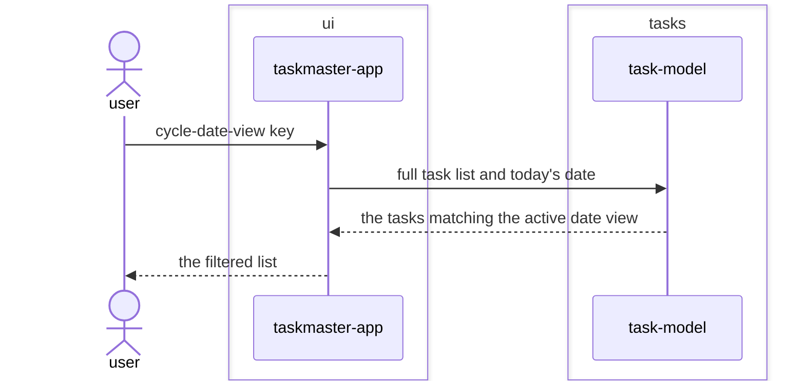

# Date-view feature design

## SUMMARY

Fulfils the due-date and overdue halves of `REQ-ARCH-002`'s pure-filter contract for the first
time. A task's due date is parsed out of the same text `add-task` already captures — a trailing
`!<ISO date>` — so no new input widget is introduced, mirroring how `REQ-FUNC-004` captured space.
A single key cycles the active date view through today, due-this-week, overdue, and unfiltered,
reusing the existing `ListView`. Per `docs/glossary.md § filter`, the date view combines with the
active space filter rather than replacing it. Every date-sensitive filter takes the reference date
as an explicit argument per `docs/adr/0004-the-reference-date-is-injected-into-the-filters.md` —
`task-model` never reads a clock.

## REQS_COVERED

- REQ-FUNC-005

## MODULES

- **ui** — dispatches the cycle-date-view key, holds the active date view, supplies the current date, and renders only the tasks satisfying both the active space and the active date view.
- **tasks** — parses a task's due date out of the entered text, and filters a list by due-today, due-this-week, and overdue, each taking the reference date as an argument.

## PORTS

> None. Filtering is a pure in-memory operation on the already-loaded task list — no load or save,
> so TaskRepository is not exercised by this feature's new code, the same shape REQ-FUNC-004 already
> established for filter-by-space.

## ADAPTERS

> None. No port is touched, so no adapter is exercised.

## DATA_FLOW

1. `ui` → `tasks` — the full task list and the current date.
2. `tasks` → `ui` — only the tasks matching the active date view, for rendering combined with the active space filter.

## DIAGRAMS

<!-- source: docs/design/diagrams/date-view.sequence.mmd -->

## DECISIONS

None. Reuses ADR 0001 through ADR 0007 unchanged — ADR 0004 in particular already settled that the
reference date is injected, not read from a clock inside task-model.

## SECURITY_TEST_PLAN

> No port is touched by this feature, the same shape REQ-FUNC-004 already established. The due-date
> token this feature parses is covered by add-task's existing input-validation-tests, same as
> filter-by-space's space token; parsing "!<date>" out of it introduces no new external input
> source.
