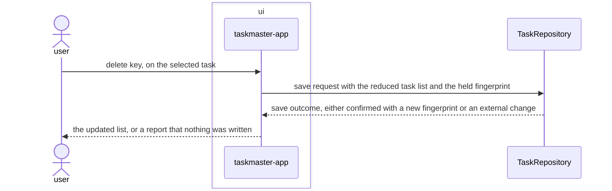

# Delete-task feature design

## SUMMARY

Lets the user remove an existing task and persist it, reusing exactly the composition root and
port `REQ-FUNC-001` established. Unlike `add-task` and `toggle-task`, this feature makes no call
into `task-model`: removing an item from a list is not a transformation of a task record, so
`tasks` is not listed as a touched module — only its already-declared `TaskRepository` port is
reused. The feature sequence diagram below is embedded by reference and is the source of truth for
its acceptance criteria; like the other two features, it stops at the port.

## REQS_COVERED

- REQ-FUNC-003

## MODULES

- **ui** — dispatches the delete key to the task already highlighted in the list, removes it from the in-memory list, and shows the resulting list or the external-change report.

## PORTS

- **TaskRepository** — reused unchanged: the same save operation REQ-FUNC-001 and REQ-FUNC-002 already exercise.

## ADAPTERS

- **JsonFileRepository** — reused unchanged.
- **InMemoryRepository** — reused unchanged, exercised by this feature's tests.

## DATA_FLOW

1. `ui` — removes the selected record from the in-memory task list.
2. `ui` → `tasks` (via `TaskRepository`) — the reduced task list, with the fingerprint held since the last load.
3. `tasks` → `ui` (via `TaskRepository`) — the save outcome: confirmed with a new fingerprint, or an external-change report.

## DIAGRAMS

<!-- source: docs/design/diagrams/delete-task.sequence.mmd -->

## DECISIONS

None. Reuses ADR 0001 through ADR 0007 unchanged.

## SECURITY_TEST_PLAN

`TaskRepository` is exercised exactly as classified in `docs/architecture/baseline.md`:
`persistence`, covered by `persistence-tests` and `input-validation-tests`. No new port, no new
classification.

- **TaskRepository** — classification: persistence (unchanged) — templates: persistence-tests, input-validation-tests.

Both templates are inherited unchanged; this feature adds no new trust boundary.
