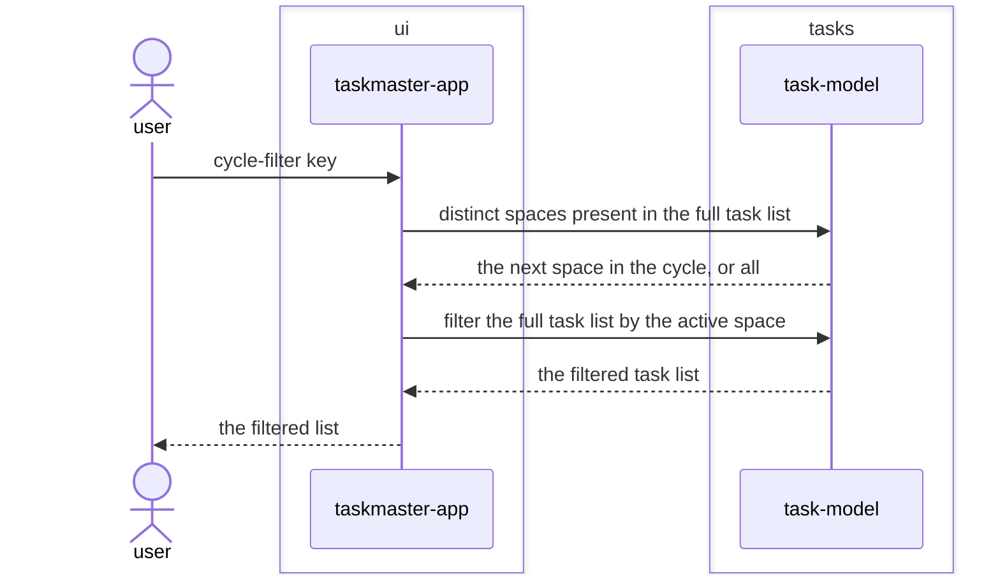

# Filter-by-space feature design

## SUMMARY

Fulfils the space half of `REQ-ARCH-002`'s pure-filter contract for the first time. A task's space
is parsed out of the same text `add-task` already captures — a trailing `@<space>` — so no new input
widget is introduced. A single key cycles the active filter through every distinct space present in
the full task list, plus an unfiltered "all" state, reusing the existing `ListView` to render
whatever subset is active. The feature sequence diagram below covers only the new interaction — the
cycle — since the underlying add-task message pair (`app → model: new task from the entered text`)
is unchanged in shape; it now simply parses a richer record from that same text.

## REQS_COVERED

- REQ-FUNC-004

## MODULES

- **ui** — dispatches the cycle-filter key, holds the active space, and renders only the filtered subset.
- **tasks** — parses a task's space out of the entered text, reports the distinct spaces present in a list, and filters a list by space.

## PORTS

> None. Filtering is a pure in-memory operation on the already-loaded task list — no load or save,
> so TaskRepository is not exercised by this feature's new code.

## ADAPTERS

> None. No port is touched, so no adapter is exercised.

## DATA_FLOW

1. `ui` → `tasks` — the full task list, to enumerate the spaces present in it.
2. `tasks` → `ui` — the distinct spaces, from which `ui` advances the active filter to the next one (or to unfiltered).
3. `ui` → `tasks` — the full task list and the active space.
4. `tasks` → `ui` — only the tasks whose space matches, for rendering.

## DIAGRAMS

<!-- source: docs/design/diagrams/filter-by-space.sequence.mmd -->

## DECISIONS

None. No new dependency, no port change, no cross-module coupling beyond what `REQ-ARCH-002`
already declared task-model would own.

## SECURITY_TEST_PLAN

No port is touched by this feature — filtering is a pure in-memory operation with no trust boundary
crossed (the task text a space is parsed from is already covered by `add-task`'s
`input-validation-tests`; parsing `@<space>` out of it introduces no new external input source).
`TaskRepository`'s existing classification and templates, established in
`docs/architecture/baseline.md`, are unchanged and not re-declared here.
