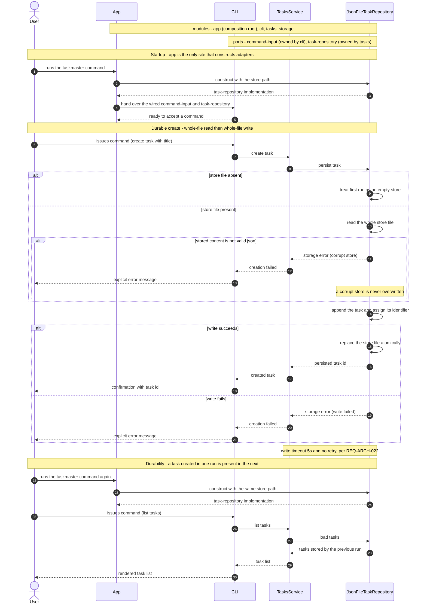

# JSON file storage — feature design

## SUMMARY

Makes Tasks durable across process runs: `app` constructs the file-backed task-repository adapter with a store path at startup, `storage` reads the whole store file, appends the Task, and promotes the new document atomically, and every failure path — an unreadable store, a failed write — surfaces to the User as an explicit error instead of silent data loss. Reuses the `app`, `cli`, `tasks`, and `storage` modules declared in `docs/architecture/system-overview.md`; adds no new architectural surface.

## REQS_COVERED

- REQ-FUNC-004
- REQ-FUNC-005
- REQ-FUNC-006
- REQ-FUNC-007

## MODULES

- **app** *(COMPOSITION_ROOT)* — wires each concrete adapter to its port and starts the process; the only module permitted to construct adapters.
- **cli** — translates a Command from the User into exactly one task operation and renders the result, including an empty Task List.
- **tasks** — owns Task creation and listing, and consumes the durable store through its own port.
- **storage** — satisfies the task-repository port with durable persistence of Tasks in a JSON file on disk.

## PORTS

- **command-input** — owner: cli — intent: inbound intake of a Command issued by the User at the trust boundary.
- **task-repository** — owner: tasks — intent: durable load and persist of Tasks.

## ADAPTERS

- **ArgparseCommandInput** — implements: command-input — runtime: `stdlib-argparse` (real)
- **ScriptedCommandInput** — implements: command-input — runtime: `stub` (test double)
- **JsonFileTaskRepository** — implements: task-repository — runtime: `json-file` (real)
- **InMemoryTaskRepository** — implements: task-repository — runtime: `in-memory` (test double)

## DATA_FLOW

Primary flow: app → cli (wiring) → tasks (via command-input) → storage (via task-repository).

Given the User runs the taskmaster command against a store path
When `app` constructs the file-backed task-repository and `tasks` persists a Task through task-repository
Then the Task is appended to the store file, the file is replaced atomically, and the persisted Task identifier returns to the User.

Given a Task persisted by an earlier run
When the User issues a `list tasks` Command against the same store path
Then `tasks` loads it through task-repository and `cli` renders a Task List containing it.

Branches:

- Given the store file does not exist, When task-repository reads it, Then the run is treated as an empty store: a persist creates the file, a `list tasks` Command renders an empty Task List and never an error.
- Given the store file content is not valid JSON, When task-repository reads it, Then a storage error returns to `tasks`, the User receives an explicit error, and the file is left unchanged.
- Given the store-file write fails, When task-repository handles it, Then a storage error returns to `tasks` with no Task identifier, and the previously stored Tasks remain intact.

## DIAGRAMS

<!-- source: docs/design/diagrams/json-storage.sequence.mmd -->

## DECISIONS

- @adr[0001] — Tasks are persisted to a JSON file; task-repository is satisfied by a file-backed adapter rather than a database.
- @adr[0004] — Hexagonal composition root: `app` is the only module that constructs concrete adapters, which is what lets REQ-FUNC-007 assert the wiring and still leave both ports substitutable in tests.
- @adr[0005] — Atomic store replacement: the new store document is written to a temporary file in the store's directory and promoted with `os.replace`, and an unreadable store aborts the persist before any write.

## SECURITY_TEST_PLAN

| Port | Trust category | Templates |
|------|----------------|-----------|
| command-input | `public-inbound` — accepts a Command from the User, who is outside the trust boundary per REQ-ARCH-001 | `authn-tests`, `authz-tests`, `input-validation-tests` |
| task-repository | `persistence` — reads and writes every Task to a file on the local disk | `persistence-tests` |

`persistence-tests` carries the weight here, and this feature is where it becomes real: the store path is the first filesystem location the product writes to, and the store file content is now untrusted input on the read path — REQ-FUNC-005 is the contract that malformed stored content is rejected rather than parsed into Tasks. The plan asserts that the store file is created with owner-only permissions, that no Task field is interpreted as a path, and that a store path outside the User's control is never written through. `authn-tests` and `authz-tests` remain planned against a single-user local CLI with no identity provider and no privilege separation, so they assert the absence of an authorization surface rather than its behaviour — carried over deliberately from `create-task.md` so a later multi-user change cannot silently inherit the exemption.
