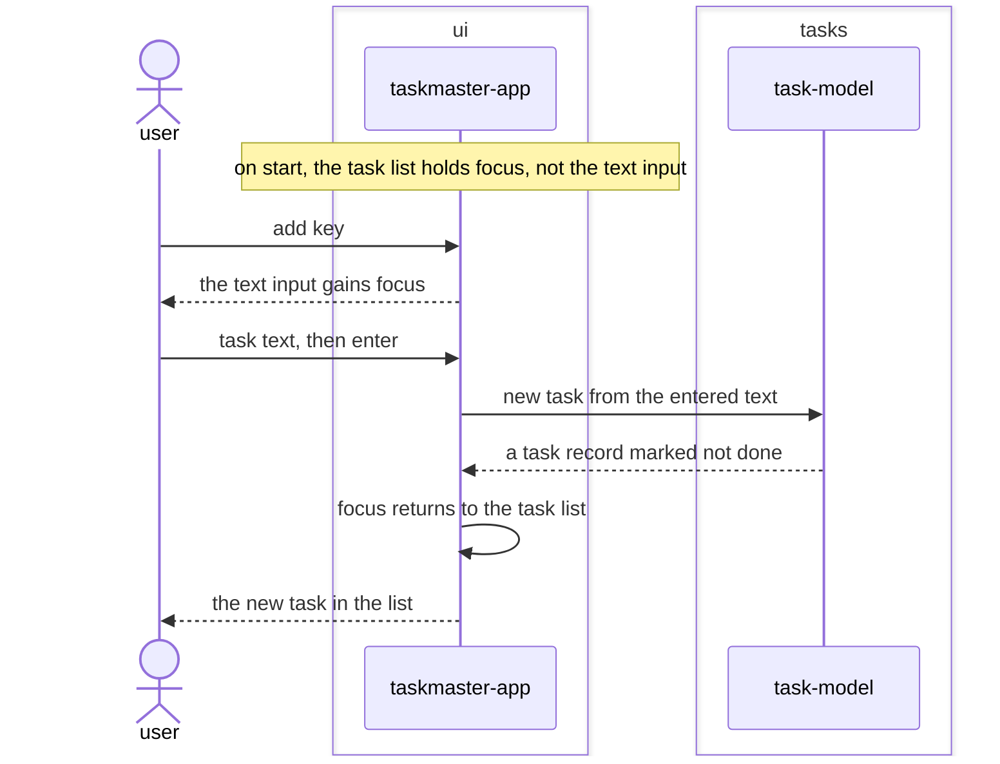

# Keyboard-focus bugfix design

## SUMMARY

Fixes a defect against `REQ-FUNC-001`'s already-approved acceptance criteria ("Given taskmaster-app
is running, When the user presses the add key and enters task text..."). As shipped, the text input
holds keyboard focus permanently from startup, so a focused `Input` widget consumes every keystroke
as literal text — `a`, `space`, `d`, `f`, and `v` never reach their `App`-level bindings at all.
Confirmed live: pressing those keys in sequence produced the input value `"dfv "`, not one bound
action firing. This affects every key binding across `REQ-FUNC-001` through `REQ-FUNC-005`, none of
which is reachable via a real keypress today.

The fix: the task list holds focus by default, not the input. The add key focuses the input rather
than submitting directly; submission happens on the input's own `Submitted` event (Enter), which
then returns focus to the list. While the list holds focus, every other single-key binding
(toggle/delete/cycle-filter/cycle-date-view) reaches the app normally, since nothing is capturing
keystrokes as text.

No new architectural surface, no new module, port, or adapter. This is corrective, not additive —
`ui`'s existing responsibility (REQ-ARCH-001, REQ-ARCH-013) already covers dispatching key presses;
this fixes how it does that.

## REQS_COVERED

- REQ-FUNC-001

## MODULES

- **ui** — corrects its own focus-management responsibility: the list holds default focus, the add key transfers it to the input, and the input's Submitted event transfers it back.

## PORTS

> None. This is a UI-internal focus-routing correction. TaskRepository and every other reused port
> is unaffected — the same save path REQ-FUNC-001 already exercises still runs, only now actually
> reachable from a real keypress.

## ADAPTERS

> None. No adapter changes; the defect and its fix are entirely within taskmaster-app's own widget
> wiring.

## DATA_FLOW

1. `ui` (self) — on start, default focus moves to the task list rather than the text input.
2. `ui` (self) — the add key moves focus to the text input; no task is built or saved at this step.
3. `ui` → `tasks` — the entered text, on the input's Submitted event (Enter), exactly as REQ-FUNC-001 already specifies for the add flow.
4. `ui` (self) — after a successful add, focus returns to the task list, restoring reachability of every other key binding.

## DIAGRAMS

<!-- source: docs/design/diagrams/keyboard-focus.sequence.mmd -->

## DECISIONS

None. No new dependency, no port change; corrects an implementation defect against an already-
approved requirement rather than introducing a new architectural decision.

## SECURITY_TEST_PLAN

> No port is touched by this fix. The entered text still reaches TaskRepository through the same
> path REQ-FUNC-001's persistence-tests and input-validation-tests already cover; this change does
> not alter what data crosses that boundary, only when the input widget is reachable to type into.
