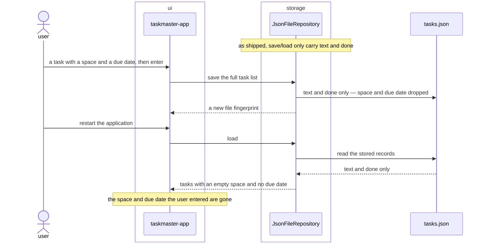

# Persist-space-and-due-date bugfix design

## SUMMARY

Fixes a data-loss defect against `REQ-FUNC-004` and `REQ-FUNC-005`'s already-approved acceptance
criteria: a task's space and due date, once set, must survive the application's own save/load
cycle — the same guarantee `REQ-ARCH-004`/`REQ-ARCH-005` already give the task's text and done
state. As shipped, `JsonFileRepository.save` serializes only `text` and `done`, and
`JsonFileRepository.load` reconstructs a `Task` from only those two keys. Every space and due date
a user enters — through `REQ-FUNC-004`/`REQ-FUNC-005`'s inline tags or `REQ-FUNC-006`'s form fields
— is silently dropped on the very next save, and lost for good on the next load. Confirmed live: a
task added with space `"casa"` and a due date came back out of the store as
`{"text": "comprar pan", "done": false}`, both fields gone. This has been true since `REQ-FUNC-004`
added `space` to `Task`; the round-trip test written then (`test_save_then_load_round_trips_...`)
only ever asserted `t.text`, so it never caught the gap when `REQ-FUNC-005` added `due_date` either.

The fix: `JsonFileRepository` serializes and reconstructs every field of `Task`, not just two of
four. `load` reads `space`/`due_date` defensively (`dict.get` with a safe default) so a store file
written before this fix — or one hand-edited to omit these keys — still loads instead of raising.

No new architectural surface, no new module, port, or adapter. This is corrective, not additive —
`REQ-ARCH-004`'s "JsonFileRepository implements TaskRepository against a local JSON file" already
covers persisting the whole task record; this fixes it to actually do that.

## REQS_COVERED

- REQ-FUNC-004
- REQ-FUNC-005

## MODULES

- **storage** — corrects `JsonFileRepository`'s own serialization: every `Task` field round-trips, not just `text`/`done`.

## PORTS

> None. `TaskRepository`'s shape (`load`/`save`, `LoadResult`/`SaveResult`) is unchanged — the defect
> and its fix are entirely inside the one adapter already implementing that port.

## ADAPTERS

> None new. `JsonFileRepository` is corrected in place; `InMemoryRepository` (the test double) never
> serialized through JSON, so it was never affected and needs no change.

## DATA_FLOW

1. `storage` (self) — on save, every field of each `Task` (`text`, `done`, `space`, `due_date`) is written to the store, not only `text` and `done`.
2. `storage` (self) — on load, every field is read back from the store; a record missing `space` or `due_date` (written before this fix) yields the same defaults `Task` itself already declares, rather than raising.

## DIAGRAMS

<!-- source: docs/design/diagrams/persist-space-and-due-date.sequence.mmd -->

## DECISIONS

None. No new dependency, no port change; corrects an implementation defect against already-approved
requirements rather than introducing a new architectural decision.

## SECURITY_TEST_PLAN

> No port is touched by this fix. The store remains arbitrary-but-trusted local content; the only
> change is that `due_date`'s existing crash-safety posture (an unparseable value never blocks
> loading) now also applies on the read-back path inside `JsonFileRepository`, matching what
> `build_task`/`new_task` already guarantee on the write path.
