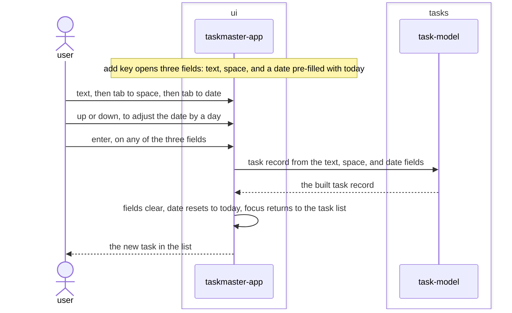

# Structured-add-form feature design

## SUMMARY

Replaces the single free-text input with three dedicated fields — text, space, and a date field
pre-filled with the current date and adjustable with the up/down keys — as the way to add a task.
`task-model`'s `new_task` inline-tag parser (`REQ-FUNC-004`, `REQ-FUNC-005`) is untouched and keeps
its own tests green; the live app simply stops calling it, building the task record directly from
the three already-distinct field values. The feature sequence diagram below covers only the new
form interaction; it does not redraw `REQ-FUNC-001`'s already-approved save/persist mechanics past
the point the task record is built.

## REQS_COVERED

- REQ-FUNC-006

## MODULES

- **ui** — composes the three form fields in place of the single input, adjusts the date field's value on up/down, and builds the task record from all three on submission.
- **tasks** — adds a pure constructor building a task record from already-distinct text, space, and due-date values, alongside the existing text-parsing `new_task`.

## PORTS

> None. Building a task record from three field values is a pure in-memory operation, the same
> shape REQ-FUNC-004/005 already established for their own pure functions. The save path itself is
> unchanged from REQ-FUNC-001 and is not redrawn here.

## ADAPTERS

> None. No adapter changes.

## DATA_FLOW

1. `ui` (self) — the add key opens three empty fields; the date field starts pre-filled with the current date.
2. `ui` (self) — up/down on the date field advances or retreats it by one day.
3. `ui` → `tasks` — on enter, the text, space, and date field values.
4. `tasks` → `ui` — the built task record, with due date absent if the date field was empty or unparseable at submission.
5. `ui` (self) — fields clear, the date field resets to the current date, focus returns to the task list.

## DIAGRAMS

<!-- source: docs/design/diagrams/structured-add-form.sequence.mmd -->

## DECISIONS

None. No new dependency (the date field is a plain `textual.widgets.Input` subclass, verified
working before being written), no port change. `new_task`'s inline-tag parser is left exactly as
`REQ-FUNC-004`/`REQ-FUNC-005` shipped it — this feature adds a second, now-primary construction
path rather than modifying the first.

## SECURITY_TEST_PLAN

> No port is touched by this feature. All three fields remain arbitrary user input, same trust
> boundary as REQ-FUNC-001's text field; the date field additionally must never crash on
> unparseable content at submission, matching the same crash-safety posture REQ-FUNC-005 already
> established for its own inline date tag.
