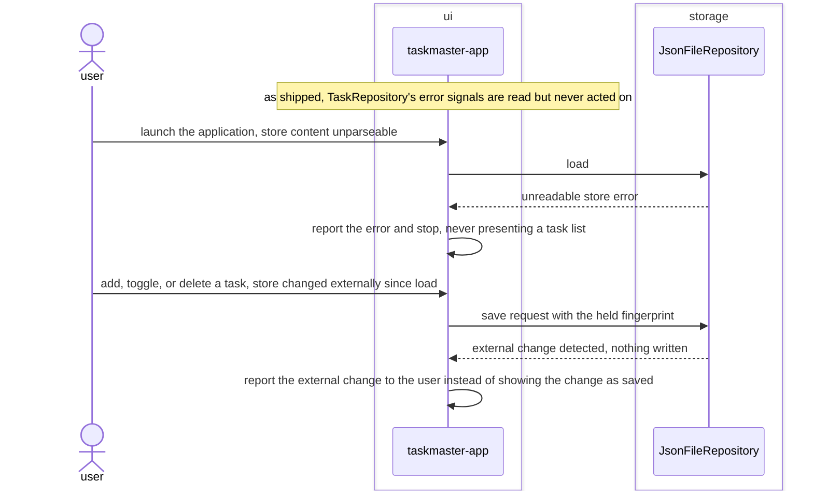

# Surface-persistence-errors bugfix design

## SUMMARY

Fixes two defects against already-approved requirements that a diagram-vs-implementation audit
caught: `TaskRepository`'s error signals are computed correctly by `JsonFileRepository` and
propagated correctly by `TaskmasterState`, but `taskmaster-app` never reads either of them.

1. **REQ-ARCH-018.** `LoadResult.error` (set when the store's content cannot be parsed) is read by
   `TaskmasterState.__init__` into nothing — `self.tasks` is just set to the empty list `LoadResult`
   already carries, and the app proceeds to show it normally. This is indistinguishable from the
   legitimate empty-store case (`REQ-ARCH-017`), which `REQ-ARCH-018`'s own acceptance criteria
   explicitly forbids, and no error ever reaches the user, which the same requirement's `STATEMENT`
   requires ("report the error and stop").
2. **REQ-FUNC-001/002/003.** Each of these already states, verbatim, "taskmaster-app reports it to
   the user instead of showing the \[change\] as saved" for the external-change case. `SaveOutcome`
   already carries `external_change: bool` from `TaskmasterState._save`, but every call site in
   `taskmaster-app` (`on_input_submitted`, `_act_on_selected`) discards the return value.

Confirmed live by tracing `TaskmasterState.__init__` and every `state.*()` call site in `app.py`, and
cross-checked against `docs/architecture/diagrams/baseline.sequence.mmd`'s `alt` branches for both
scenarios — both were drawn in the sequence diagram from the very first architecture cycle and never
fully wired past the `tasks`/`storage` boundary into `ui`.

The fix: `TaskmasterApp` reads both signals it already receives.

- On startup, if `TaskmasterState.load_error` is set, `on_mount` calls `self.exit(message=...)`
  before ever refreshing the list or pushing the welcome screen — no task list is ever presented,
  matching `REQ-ARCH-018`'s "does not present a task list" criterion exactly.
- On every add/toggle/delete, if the returned `SaveOutcome.external_change` is `True`, the status
  line (already used by `REQ-FUNC-008`) shows a message instead of the normal filter summary until
  the next successful save.

## REQS_COVERED

- REQ-ARCH-018
- REQ-FUNC-001
- REQ-FUNC-002
- REQ-FUNC-003

## MODULES

- **ui** — `TaskmasterState` exposes the load error it already receives; `taskmaster-app` reads it on startup and reads `SaveOutcome.external_change` on every mutating action.

## PORTS

> None. `TaskRepository`'s shape is unchanged — both signals this fix wires up (`LoadResult.error`, `SaveResult`/`SaveOutcome.external_change`) already exist on the port; nothing new crosses it.

## ADAPTERS

> None. No adapter changes — `JsonFileRepository` already computes both signals correctly (already covered by its own tests); the defect was entirely on the consuming side.

## DATA_FLOW

1. `ui` (self) — at startup, if the load carried an error, the app reports it and exits without ever refreshing the task list or pushing the welcome screen.
2. `ui` (self) — on every add/toggle/delete, if the save outcome reports an external change, the status line shows that instead of the filter summary, until the next successful save restores it.

## DIAGRAMS

<!-- source: docs/design/diagrams/surface-persistence-errors.sequence.mmd -->

## DECISIONS

None. No new dependency, no port change; corrects implementation defects against already-approved
requirements rather than introducing new architectural decisions. Reuses `App.exit(message=...)`
(Textual's own startup-abort mechanism) and the existing `#filter-status` line rather than adding a
new widget for either case.

## SECURITY_TEST_PLAN

> No port is touched by this fix. The exit message and the status-line warning are both
> author-controlled strings, not user input, so there is no new untrusted-input surface.
