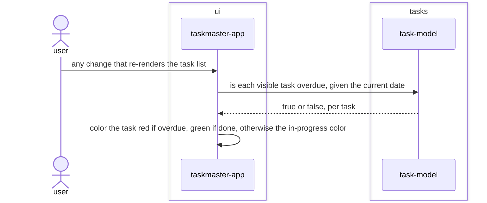

# Task-status-colors feature design

## SUMMARY

Colors each visible task by status: red when overdue, green when done, a distinct "in progress"
color otherwise. `task-model` gains `is_overdue(task, today)`, a per-task predicate factoring out
the exact boundary check `overdue()` already used inline (`not task.done and task.due_date and
task.due_date < today`) — `overdue()` is refactored to call it, so the business rule lives in
exactly one place. `ui` classifies each task via `is_overdue`/`task.done` and applies a Textual CSS
class (`overdue`/`done`/`in-progress`) to its list item; the app's `CSS` block maps each class to a
color. No new `Task` field, no markup risk — styling is a CSS class, never text interpolation, so
arbitrary task text stays exactly as safe as it is today.

## REQS_COVERED

- REQ-FUNC-009

## MODULES

- **tasks** — adds `is_overdue`, a pure per-task predicate; `overdue()` is refactored to use it, its own tests and REQ-FUNC-005 behavior unchanged.
- **ui** — classifies each visible task and applies the matching CSS class when rendering the list.

## PORTS

> None. Both changes are pure/display — no new port, no port signature change.

## ADAPTERS

> None. No adapter changes.

## DATA_FLOW

1. `ui` → `tasks` — on every list render, each visible task and the current date, asking whether it is overdue.
2. `tasks` → `ui` — true or false, per task, from `is_overdue`.
3. `ui` (self) — the task's list item gets the `overdue`, `done`, or `in-progress` CSS class based on that answer and `task.done`; the app's CSS maps each class to its color.

## DIAGRAMS

<!-- source: docs/design/diagrams/task-status-colors.sequence.mmd -->

## DECISIONS

None. No new dependency — Textual's own CSS class system covers per-item coloring; no new `Task`
field, since "in progress" is fully derivable from the existing `done`/`due_date` fields (see the
new `in progress` glossary entry) rather than a state that needs to be stored.

## SECURITY_TEST_PLAN

> No port is touched by this feature. Task text remains rendered with `markup=False`, unchanged;
> the new coloring is applied via a CSS class on the list item, never by interpolating task data
> into a style string, so there is no new path for task content to influence rendering beyond what
> REQ-ARCH-018 already governs.
