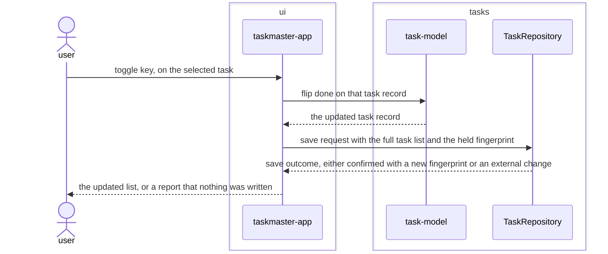

# Toggle-task feature design

## SUMMARY

Lets the user flip an existing task's done state and persist it, reusing exactly the modules and
port `REQ-FUNC-001` established: `taskmaster-app` dispatches a second key binding to the already
selected item, `task-model` transforms the record, and the save goes through `TaskRepository`
unchanged. No new module, port, or adapter. The feature sequence diagram below is embedded by
reference and is the source of truth for its acceptance criteria — like `add-task`, it stops at the
`TaskRepository` port, since everything below it is already specified by `REQ-ARCH-010` through
`REQ-ARCH-021`.

## REQS_COVERED

- REQ-FUNC-002

## MODULES

- **ui** — dispatches the toggle key to the task already highlighted in the list, and shows the resulting list or the external-change report.
- **tasks** — flips the done state on the selected task record.

## PORTS

- **TaskRepository** — reused unchanged: the same save operation REQ-FUNC-001 already exercises.

## ADAPTERS

- **JsonFileRepository** — reused unchanged.
- **InMemoryRepository** — reused unchanged, exercised by this feature's tests.

## DATA_FLOW

1. `ui` → `tasks` — the selected task record.
2. `tasks` → `ui` — the same record with its done state flipped.
3. `ui` → `tasks` (via `TaskRepository`) — the full task list, including the flipped record, with the fingerprint held since the last load.
4. `tasks` → `ui` (via `TaskRepository`) — the save outcome: confirmed with a new fingerprint, or an external-change report.

## DIAGRAMS

<!-- source: docs/design/diagrams/toggle-task.sequence.mmd -->

## DECISIONS

None. Reuses ADR 0001 through ADR 0007 unchanged — see `docs/architecture/baseline.md § DECISIONS`
and `docs/adr/0007-textual-as-the-tui-framework.md`.

## SECURITY_TEST_PLAN

`TaskRepository` is exercised exactly as classified in `docs/architecture/baseline.md`:
`persistence`, covered by `persistence-tests` and `input-validation-tests`. No new port, no new
classification.

- **TaskRepository** — classification: persistence (unchanged) — templates: persistence-tests, input-validation-tests.

Both templates are inherited unchanged; this feature adds no new trust boundary.
