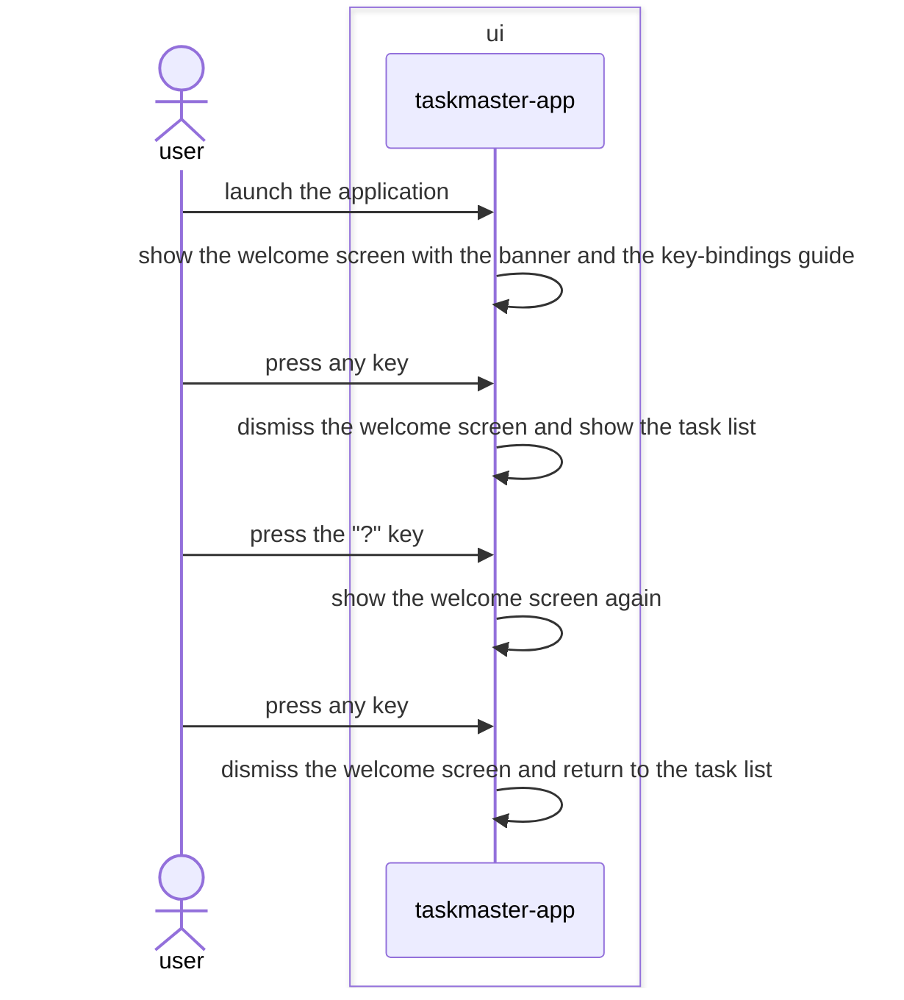

# Welcome-screen feature design

## SUMMARY

Adds a static welcome screen shown before the task list on launch, carrying the ASCII banner and a
list of the app's key bindings, dismissed by any keypress. The same screen is reachable again later
via the "?" key. It is a second `textual.screen.Screen` pushed by `taskmaster-app`, not a new module —
static content and pure display, no new port, no persisted "seen" state.

## REQS_COVERED

- REQ-FUNC-007

## MODULES

- **ui** — adds a `WelcomeScreen` and mounts it before the main screen on launch; binds "?" to push it again on demand.

## PORTS

> None. A static display screen reads and persists nothing.

## ADAPTERS

> None. No adapter changes.

## DATA_FLOW

1. `ui` (self) — on launch, before the task list mounts, the welcome screen is pushed showing the banner and the key-bindings guide.
2. `ui` (self) — any keypress on the welcome screen pops it, revealing the task list underneath.
3. `ui` (self) — the "?" key, while the task list has focus, pushes the welcome screen again.
4. `ui` (self) — any keypress on the welcome screen pops it, returning to the task list.

## DIAGRAMS

<!-- source: docs/design/diagrams/welcome-screen.sequence.mmd -->

## DECISIONS

None. No new dependency — Textual's own `Screen` push/pop stack covers "shown first, dismissed by any
key, reachable again later" with no state machine and no persisted "seen" flag. The banner and guide
text are static `Static`/`Label` content, not interactive fields, so this is not a wizard: nothing to
step through, nothing to validate, nothing to submit.

## SECURITY_TEST_PLAN

> No port is touched by this feature. All content is static and author-controlled (the banner and the
key-bindings guide), not user input, so there is no untrusted-input surface to test.
